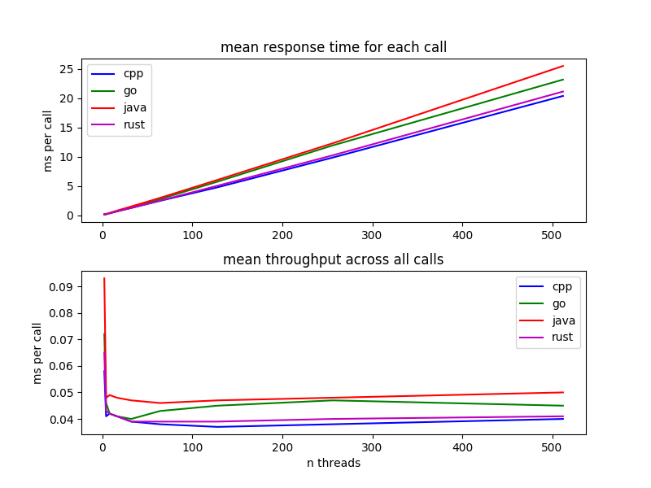

## Basic HTTP Server Benchmark  

* c++ crow  
* go http  
* java jetty  
* rust actix  

### Requirements  
* golang  
* git  
* jdk  
* gradle  
* gcc  
* rustup  
* cargo  

* As ran on AMD Ryzen Threadripper 1950X 16-Core
