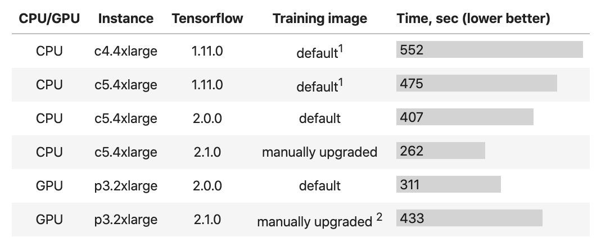

#### Tensorflow training time depending on the instance configuration  

<!--

| CPU/GPU | Instance | Tensorflow | Training image | Time, sec (lower better) |
|:-:|:-:|:-:|:-:|:-|
| CPU | c4.4xlarge | 1.11.0 | default1 | &nbsp;552 |
| CPU | c5.4xlarge | 1.11.0 | default1 | &nbsp;475 |
| CPU | c5.4xlarge | 2.0.0 | default | &nbsp;407 |
| CPU | c5.4xlarge | 2.1.0 | manually upgraded | &nbsp;262 |
| GPU | p3.2xlarge | 2.0.0 | default | &nbsp;311 |
| GPU | p3.2xlarge | 2.1.0 | manually upgraded 2 | &nbsp;433 |

-->

    
___  

1 SageMaker default, if no `framework_version` parameter is provided.  
2 fallback to CPU due to unmet dependencies.

* c4 is based on Intel Xeon E5-2666 v3 (Haswell) with AVX2 (256).
* C5 is based on Intel Xeon Scalable Processors (Cascade Lake) with AVX512.
* p3 is based on NVIDIA Volta V100 GPU.